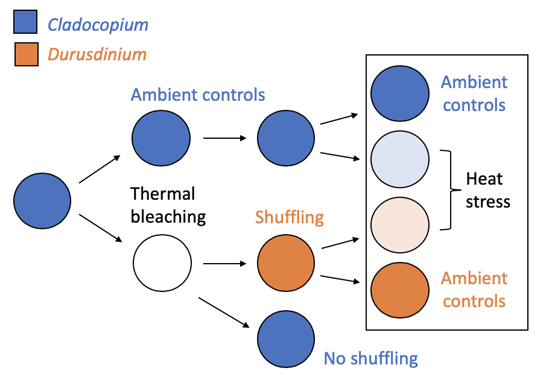

```{r setup, include=FALSE}
knitr::opts_chunk$set(echo = TRUE, warning = FALSE, message = FALSE, cache = TRUE)
```

```{r, include = FALSE}
# Load libraries
library(DESeq2)
library(limma)
library(tidyverse)
library(stringr)
library(readxl)
library(pheatmap)
library(RColorBrewer)
library(variancePartition) #BiocManager::install('variancePartition')
library(doParallel)
library(cowplot)
source("code/GO_MWU/gomwu.functions.R")
```

# Experimental design



# Import data and create DESeqDataSet
```{r}
# Import gene expression / count data
counts <- read.table("data/tagseq/processed/counts.txt", 
                     header = TRUE, row.names = 1)
# Trim column names to just the sample name
colnames(counts) <- str_sub(colnames(counts), 1, 7)
# Sort columns by sample name
counts <- counts[, order(colnames(counts))]

# Import sample metadata
sdat <- read_xlsx("data/sample_metadata.xlsx") %>%
  mutate(sample = paste0(species, colony, ".", core),
         sym = if_else(trt1 == "c", "C", "D"),     # recode treatment names
         trt = if_else(trt2 == "h", "heat", "ctrl"),
         symtrt = interaction(sym, trt),
         colony = factor(colony)) %>%
  mutate_if(is.character, as.factor) %>%
  arrange(sample) %>%                              # order by sample name
  column_to_rownames(var = "sample")               # set sample name to rownames

# Create full DESeqDataSet
dds <- DESeqDataSetFromMatrix(countData = counts,
                              colData = sdat,
                              design = ~ colony)
```

### Subset DESeqDataSet for only those samples in repeat heat stress experiment
```{r}
# (Only colonies 20, 22, and 26 were in repeat heat stress exp)
# (Only time point at end of heat stress)
hs.dds <- dds[, !is.na(colData(dds)$symtrt)]

# Add design formula for heat stress experiment and DROP UNUSED FACTOR LEVELS!
design(hs.dds) <- formula(~ colony + symtrt)
colData(hs.dds) <- droplevels(colData(hs.dds))
```

# QC/pre-filter count data
```{r, fig.height = 4, fig.width = 10}
# Number of samples
nsamples <- ncol(counts(hs.dds))
# Number of reads per sample
rps <- qplot(colSums(counts(hs.dds))) +
  labs(x = "Reads per sample", y = "Number of samples",
       title = "Read counts per sample") +
  geom_label(aes(x = 6e5, y = 10, label = paste(nsamples, "samples")))
# Sample Mc20-05 has far more counts than others -- may need to rarefy this sample down to median count?

# Number of genes
# Remove genes with counted less than three times across entire dataset
hs.dds <- hs.dds[ rowSums(counts(hs.dds)) > 3, ]
ngenes <- nrow(counts(hs.dds))
# Number of reads per gene
rpg <- qplot(log10(rowSums(counts(hs.dds)))) +
  labs(x = "Reads per gene", y = "Number of genes",
       title = "Read counts per gene") +
  geom_label(aes(x = 4, y = 750, label = paste(ngenes, "genes")))

plot_grid(rps, rpg)

# Normalize expression data for visualization purposes using VST tranformation
vsd <- vst(hs.dds, blind = FALSE)
```

# Visualize samples in multivariate space

### Principal Component Analysis 
(based on normalized gene counts)
** Wright et al. also perform PCoA only including DEGs, and of course this shows more clustering by group...
** Could also consider performing PCoA only including genes with <50% residual variance?
```{r}
## Run PCA and return data to visualize with ggplot
pcaData <- plotPCA(vsd, intgroup = c( "colony", "sym", "trt"), returnData = TRUE)
percentVar <- round(100 * attr(pcaData, "percentVar"))

## Plot PCA
ggplot(pcaData, aes(x = PC1, y = PC2, color = colony, shape = sym, size = trt)) +
  geom_point(alpha = 0.5) +
  labs(title =  "PCA: all genes") +
  xlab(paste0("PC1: ", percentVar[1], "% variance")) +
  ylab(paste0("PC2: ", percentVar[2], "% variance"))
```

### Principal Coordinate Analysis
(based on sample distances)
```{r}
## Calculate Euclidean distances among samples
sampleDists <- dist(t(assay(vsd)))
sampleDistMatrix <- as.matrix( sampleDists )

## Plot NMDS
mds <- as.data.frame(colData(vsd))  %>%
         cbind(cmdscale(sampleDistMatrix))
ggplot(mds, aes(x = `1`, y = -`2`, color = colony, shape = sym, size = trt)) +
  geom_point(alpha = 0.5) + coord_fixed() +
  labs(title = "PCoA: all genes")
```

+ Both PCA and NMDS show that samples are most clearly differentiated by colony
+ Colony 26 (and colony 20 but less-so and in opp. dir.) is separated by symbiont (or past treatment)
+ Colony 22 separates a little by heat treatment, other colonies do not

# Partition total variance among explanatory factors
```{r}
# optional step to run analysis in parallel on multicore machines
# Here use 8 threads
# This is strongly recommended since the analysis
# can be computationally intensive
cl <- makeCluster(8)
registerDoParallel(cl)

# Get normalized read counts for hs.dds / heat stress experiment
ncounts <- assay(vsd)   # normalized counts, previously filtered to remove genes with total count < 3
# Specify variables to consider
form <- ~ (1|colony) + (1|symtrt) + (1|tank)
# Get sample metadata
info <- data.frame(colData(hs.dds))

# Fit model and extract results
# Interpretation: the variance explained by each variables after correcting for all other variables
varPart <- fitExtractVarPartModel(ncounts, form, info)
stopCluster(cl)

# sort variables (i.e. columns) by median fraction of variance explained
vp <- sortCols( varPart )
```

```{r}
# Violin plot of contribution of each variable to total variance, each point is a gene
#plotVarPart( vp , label.angle = 60)
# This plot shows that for most genes, most variance is residual/unexplained.
# Filter these genes down to look only at those whose variance is explained (>50%) by exp. design

# Filter out the genes where >50% of the variance remains unexplained by colony/symtrt/tank
vpf <- varPart[varPart$Residuals < 0.5, ]

# Violin plot of contribution of each variable to total variance, each point is a gene
plotVarPart( vpf , label.angle = 60, main = "Variance fraction explained")

# Of these genes, calculate median variance explained by colony vs. symbiont/treatment vs. tank effect:
vpf %>% summarize_all(median) %>% knitr::kable(caption = "Median variance explained for all genes")
```

+ Colony (genotype) explains 10x more of the variation in overall gene expression than anything else

For plotting and visualizing the differences that ARE driven by treatments, it will be helpful to remove the effect of colony. 

```{r}
# remove colony effect for downstream visualization 
## but note DE testing will still use the un-corrected normailzed count data
vsd2 <- vsd
assay(vsd2) <- limma::removeBatchEffect(assay(vsd), vsd$colony)
```

# Differential expression testing

## Run DESeq pipeline
```{r, warning=FALSE}
hs.dds <- DESeq(hs.dds)
```

## D vs. C corals at ambient temperature
```{r}
# Test for differential expression between D and C corals in the control treatment
Dctrl.Cctrl <- results(hs.dds, contrast = c("symtrt", "D.ctrl", "C.ctrl"))

# Subset DE genes with adjusted p-value < 0.1
Dctrl.Cctrl.sig <- Dctrl.Cctrl[which(Dctrl.Cctrl$padj < 0.1 ), ]
Dctrl.Cctrl.p05 <- Dctrl.Cctrl[which(Dctrl.Cctrl$pvalue < 0.05), ]

# Get names of DE genes
Dctrl.Cctrl.DEgenes <- rownames(Dctrl.Cctrl.sig)
# Mcavernosa08323: Peroxiredoxin-5 -- protection against oxidative stress

# Summarize DE
as.data.frame(Dctrl.Cctrl) %>%
  filter(padj < 0.1) %>%
  summarise(total = n(),
            up = sum(log2FoldChange > 0),
            down = sum(log2FoldChange < 0)) %>%
  knitr::kable(caption = "Differential expression")
```

```{r}
# Make a heatmap
# Build function to make a heatmap
phm <- function(sig, vsd, grp, lvl, var, ...) {
  sig.up <- sig[sig$log2FoldChange > 0, ]
  sig.down <- sig[sig$log2FoldChange < 0, ]
  # Subset just DE genes from only Dctrl and Cctrl samples
  mat <- assay(vsd)[rownames(sig), colData(vsd)[, grp] == lvl]
  mat <- mat - rowMeans(mat)
  # Order columns (samples) by treatment, and order rows (genes) by up vs. down
  anno <- as.data.frame(colData(vsd)[colData(vsd)[, grp] == lvl, c("sym", "trt")])
  anno <- anno[order(anno[var]), ]
  mat <- mat[c(rownames(sig.up), rownames(sig.down)), rownames(anno)]
  pheatmap(..., mat, annotation_col = anno, cluster_cols = F, cluster_rows = F,
           color = colorRampPalette(rev(brewer.pal(n=7, name = "RdYlBu")))(100))
}

phm(Dctrl.Cctrl.sig, vsd2, "trt", "ctrl", "sym", main = "D vs. C corals at ambient temp")
```

```{r, eval = FALSE}
## Use GO_MWU to look at function of DE genes
# Only run this once -- once output files generated, no need to rerun analysis

# Generate logP values
Dctrl.Cctrl$logP <- -log10(Dctrl.Cctrl$pvalue) * sign(Dctrl.Cctrl$log2FoldChange)

# Write to file
setwd("code/GO_MWU")
write.table(data.frame(gene=rownames(Dctrl.Cctrl), logP=Dctrl.Cctrl$logP), 
            file = "Dctrl.Cctrl.logP.txt",
            row.names = FALSE, quote = FALSE, sep = ",")

# Run GO_MWU
commandArgs <- function(...) c("Dctrl.Cctrl.logP.txt", "BP")
source("GO_MWU.R")
```

```{r}
# Plot GO_MWU results
setwd("code/GO_MWU")
resultsBP <- gomwuPlot(inFile = "Dctrl.Cctrl.logP.txt",
                     goAnnotations = "Mcavernosa_gene2go.txt",
                     goDivision = "BP",
                     level1 = 0.1, level2 = 0.05, level3 = 0.01, txtsize = 1.2, treeHeight = 0.5)
# save text representation of results to file
# save(resultsBP, file = "Dctrl.Cctrl.GO_MWU.results.RData")
```

Red GO terms are significantly upregulated in D vs. C corals at ambient temp. Blue terms are significantly downregulated.

### Annotations of genes upregulated in D vs. C controls
```{r}
data.frame(Dctrl.Cctrl.sig) %>%
  mutate(gene = rownames(.)) %>%
  arrange(-log2FoldChange)

#Mcavernosa23377
plotCounts(hs.dds, gene = "Mcavernosa23377", intgroup = c("sym", "trt"))
# no good annotations for this protein. 

#Mcavernosa23531
plotCounts(hs.dds, gene = "Mcavernosa23531", intgroup = c("sym", "trt"))
# has a BRICHOS domain, which may have something to do with post-translational modification

#Mcavernosa01063
plotCounts(hs.dds, gene = "Mcavernosa01063", intgroup = c("sym", "trt"))
#A toxin in nematocysts. Kalicludines and kaliseptine

#Mcavernosa01062
plotCounts(hs.dds, gene = "Mcavernosa01062", intgroup = c("sym", "trt"))
# Transmembrane protein with extracellular Kunitz domain/trypsin inhibitor
# Trypsin is an enzyme that breaks things down as part of digestion... arrested phagosome?

#Mcavernosa00334
plotCounts(hs.dds, gene = "Mcavernosa00334", intgroup = c("sym", "trt"))
# RNA processing?

#Mcavernosa05961
plotCounts(hs.dds, gene = "Mcavernosa05961", intgroup = c("sym", "trt"))
#Enkurin -- could be localized to cilia? Sigg et al.

#Mcavernosa01259
plotCounts(hs.dds, gene = "Mcavernosa01259", intgroup = c("sym", "trt"))
# hsp molecular chaperone DnaJ domain

#Mcavernosa08323
plotCounts(hs.dds, gene = "Mcavernosa08323", intgroup = c("sym", "trt"))
# Peroxiredoxin - Thioredoxin-like - response to oxidative stress
# See Maor-Landaw and Levy 2016 for analysis of expression in corals

#Mcavernosa32478
plotCounts(hs.dds, gene = "Mcavernosa32478", intgroup = c("sym", "trt"))
# kintoun - cilia protein?
# kintoun-like protein found to be SNP outlier in corals adapted to hot Palau lagoons (H Rivera dissertation)
# could function as stress response chaperone (von Morgen et al.)

#Mcavernosa05331
plotCounts(hs.dds, gene = "Mcavernosa05331", intgroup = c("sym", "trt"))
#BMP-binding endothelial regulator protein - crossveinless2. lots of different domains on InterPro...

#Mcavernosa10389
plotCounts(hs.dds, gene = "Mcavernosa10389", intgroup = c("sym", "trt"))
#Major family superfamily (MFS transporter) domain containing protein
# Transports small solutes. may transport G3P
# Sproles et al. -- MFS transporters in cnidarian dinoflagellate symbiosis

#Mcavernosa04519
plotCounts(hs.dds, gene = "Mcavernosa04519", intgroup = c("sym", "trt"))
# Copper-transporting ATPase

# Mcavernosa09839
plotCounts(hs.dds, gene = "Mcavernosa09839", intgroup = c("sym", "trt"))
# tyrosine phosphatase

# Mcavernosa03538
plotCounts(hs.dds, gene = "Mcavernosa03538", intgroup = c("sym", "trt"))
# no annotations, signal peptide domain and non-cytoplasmic domain on INterPro

# Mcavernosa10382
plotCounts(hs.dds, gene = "Mcavernosa10382", intgroup = c("sym", "trt"))
# protein prune homolog
# interacts with pro and anti apoptotic proteins (InterPro) 

#Mcavernosa13113
plotCounts(hs.dds, gene = "Mcavernosa13113", intgroup = c("sym", "trt"))
# serine incorporator

```

### Annotations of genes downregulated in D vs. C controls

```{r}
# Mcavernosa29636
plotCounts(hs.dds, gene = "Mcavernosa29636", intgroup = c("sym", "trt"))
# leucine-rich repeat-containing protein

#Mcavernosa16961
plotCounts(hs.dds, gene = "Mcavernosa16961", intgroup = c("sym", "trt"))
# protein-protein interactions

#Mcavernosa08291
plotCounts(hs.dds, gene = "Mcavernosa08291", intgroup = c("sym", "trt"))
# "serologically defined colon cancer antigen" 
# aka ENTR1 - endosome-associated-trafficking regulator 1
# without it, TNF receptor expression is reduced, resulting in resistance to TNF-induced apoptosis
# and also protein trafficking and secretion decreased. (Neznanov et al. 2005)

#Mcavernosa35232
plotCounts(hs.dds, gene = "Mcavernosa35232", intgroup = c("sym", "trt"))
# no blast hits or annotations
# mobidb disoarder prediction

#Mcavernosa10380
plotCounts(hs.dds, gene = "Mcavernosa10380", intgroup = c("sym", "trt"))
#hsp20-like chaperone, calcyclin-binding, 
# interacts with SIAH, an E3 ubiquitin ligase with role in apoptosis


#Mcavernosa32338
plotCounts(hs.dds, gene = "Mcavernosa32338", intgroup = c("sym", "trt"))
# Ras-related protein Rab33, GTPase activity
# GTPases control assembly of vesicle coats for transport vesicles

#Mcavernosa15521
plotCounts(hs.dds, gene = "Mcavernosa15521", intgroup = c("sym", "trt"))
#BRO1 domain - vacuoles and lysosomes targeting - interpro
# programmed cell death interacting protein - blast
# Li et al. Sci Adv -- DE in symbiosis establishment/breakdown aiptasia

# Mcavernosa30546
plotCounts(hs.dds, gene = "Mcavernosa30546", intgroup = c("sym", "trt"))
# CAAX prenyl protease -- protein degradation?
# Kirk et al. 2018 Mol Ecol

# Mcavernosa13875
plotCounts(hs.dds, gene = "Mcavernosa13875", intgroup = c("sym", "trt"))
# DNA-binding, transcription factor

# Mcavernosa25626
plotCounts(hs.dds, gene = "Mcavernosa25626", intgroup = c("sym", "trt"))

#Mcavernosa15354
plotCounts(hs.dds, gene = "Mcavernosa15354", intgroup = c("sym", "trt"))

# Mcavernosa21783
plotCounts(hs.dds, gene = "Mcavernosa21783", intgroup = c("sym", "trt"))
# peroxisomal membrane protein
# peroxisomes involved in reduction of hydrogen peroxide / oxidative stress
```

## D vs. C corals under heat stress
```{r}
# Test for differences between D and C corals in the heated treatment
Dheat.Cheat <- results(hs.dds, contrast=c("symtrt", "D.heat", "C.heat"))

# Subset DE genes with adjusted p-value < 0.1
Dheat.Cheat.sig <- Dheat.Cheat[which(Dheat.Cheat$padj < 0.1 ), ]
Dheat.Cheat.p05 <- Dheat.Cheat[which(Dheat.Cheat$pvalue < 0.05), ]

# Get names of DE genes
Dheat.Cheat.DEgenes <- rownames(Dheat.Cheat.sig)

# Summarize DE
as.data.frame(Dheat.Cheat) %>%
  filter(padj < 0.1) %>%
  summarise(total = n(),
            up = sum(log2FoldChange > 0),
            down = sum(log2FoldChange < 0)) %>%
  knitr::kable(caption = "Differential expression")
```

```{r eval = FALSE, fig.height = 2, fig.width = 7}
# Make a heatmap
phm(Dheat.Cheat.sig, vsd2, "trt", "heat", "sym")
```

Only three genes are differentially expressed between D and C corals under heat stress. Not enough genes to run a GO enrichment analysis.

## Heat vs. control in C corals

```{r}
# Test for differences between C corals in the control vs. heated treatment
Cheat.Cctrl <- results(hs.dds, contrast=c("symtrt", "C.heat", "C.ctrl"))

# Subset DE genes with adjusted p-value < 0.1
Cheat.Cctrl.sig <- Cheat.Cctrl[which(Cheat.Cctrl$padj < 0.1 ), ]
Cheat.Cctrl.p05 <- Cheat.Cctrl[which(Cheat.Cctrl$pvalue < 0.05), ]

# Get names of DE genes
Cheat.Cctrl.DEgenes <- rownames(Cheat.Cctrl.sig)

# Summarize DE
as.data.frame(Cheat.Cctrl) %>%
  filter(padj < 0.1) %>%
  summarise(total = n(),
            up = sum(log2FoldChange > 0),
            down = sum(log2FoldChange < 0)) %>%
  knitr::kable(caption = "Differential expression")

# Make a heatmap
phm(Cheat.Cctrl.sig, vsd2, "sym", "C", "trt")   # use vsd2 for the normcounts with batch (colony) effect removed
```

```{r, eval = TRUE}
## Use GO_MWU to look at function of DE genes
# Only run this once -- once output files generated, no need to rerun analysis

# Generate logP values
Cheat.Cctrl$logP <- -log10(Cheat.Cctrl$pvalue) * sign(Cheat.Cctrl$log2FoldChange)

# Write to file
setwd("code/GO_MWU")
write.table(data.frame(gene=rownames(Cheat.Cctrl), logP=Cheat.Cctrl$logP), 
            file = "Cheat.Cctrl.logP.txt",
            row.names = FALSE, quote = FALSE, sep = ",")

# Run GO_MWU
commandArgs <- function(...) c("Cheat.Cctrl.logP.txt", "BP")
source("GO_MWU.R")
```

```{r}
# Plot GO_MWU results
setwd("code/GO_MWU")
results <- gomwuPlot(inFile = "Cheat.Cctrl.logP.txt",
                     goAnnotations = "Mcavernosa_gene2go.txt",
                     goDivision = "BP",
                     level1 = 0.05, level2 = 0.025, level3 = 0.01, txtsize = 1.2, treeHeight = 0.5)
# save text representation of results to file
# save(results, file = "Cheat.Cctrl.GO_MWU.results.RData")
```

Red GO terms are significantly upregulated in heated vs. control C corals. Blue terms are significantly downregulated.


## Heat vs. control in D corals

```{r}
# Test for differences between D corals in the control vs. heated treatment
Dheat.Dctrl <- results(hs.dds, contrast=c("symtrt", "D.heat", "D.ctrl"))

# Subset DE genes with adjusted p-value < 0.1
Dheat.Dctrl.sig <- Dheat.Dctrl[which(Dheat.Dctrl$padj < 0.1 ), ]
Dheat.Dctrl.p05 <- Dheat.Dctrl[which(Dheat.Dctrl$pvalue < 0.05), ]

# Get names of DE genes
Dheat.Dctrl.DEgenes <- rownames(Dheat.Dctrl.sig)

# Summarize DE
as.data.frame(Dheat.Dctrl) %>%
  filter(padj < 0.1) %>%
  summarise(total = n(),
            up = sum(log2FoldChange > 0),
            down = sum(log2FoldChange < 0)) %>%
  knitr::kable(caption = "Differential expression")

# Make a heatmap
phm(Dheat.Dctrl.sig, vsd2, "sym", "D", "trt")
```

```{r, eval = TRUE}
## Use GO_MWU to look at function of DE genes
# Only run this once -- once output files generated, no need to rerun analysis

# Generate logP values
Dheat.Dctrl$logP <- -log10(Dheat.Dctrl$pvalue) * sign(Dheat.Dctrl$log2FoldChange)

# Write to file
setwd("code/GO_MWU")
write.table(data.frame(gene=rownames(Dheat.Dctrl), logP=Dheat.Dctrl$logP), 
            file = "Dheat.Dctrl.logP.txt",
            row.names = FALSE, quote = FALSE, sep = ",")

# Run GO_MWU
commandArgs <- function(...) c("Dheat.Dctrl.logP.txt", "BP")
source("GO_MWU.R")
```

```{r}
# Plot GO_MWU results
setwd("code/GO_MWU")
results <- gomwuPlot(inFile = "Dheat.Dctrl.logP.txt",
                     goAnnotations = "Mcavernosa_gene2go.txt",
                     goDivision = "BP",
                     level1 = 0.05, level2 = 0.025, level3 = 0.01, txtsize = 1.2, treeHeight = 0.5)
# save text representation of results to file
# save(results, file = "Dheat.Dctrl.GO_MWU.results.RData")
```

Red GO terms are significantly upregulated in heated vs. control D corals. Blue terms are significantly downregulated.


# Overlap in DEGs
```{r}
dc.cc <- rownames(counts(hs.dds)) %in% Dctrl.Cctrl.DEgenes
dh.ch <- rownames(counts(hs.dds)) %in% Dheat.Cheat.DEgenes
ch.cc <- rownames(counts(hs.dds)) %in% Cheat.Cctrl.DEgenes
dh.dc <- rownames(counts(hs.dds)) %in% Dheat.Dctrl.DEgenes

a <- cbind(dc.cc, ch.cc, dh.dc)
vennDiagram(vennCounts(a))

# a <- cbind(ch.cc, dh.dc)
# vennDiagram(vennCounts(a))
# 
# a <- cbind(dh.ch, dc.cc)
# vennDiagram(vennCounts(a))
# 
# a <- cbind(dc.cc, ch.cc)
# vennDiagram(vennCounts(a))
```

# Ordination with only DEGs (DEGs from all contrasts)
```{r}
# Subset DEGs as padj < 0.1
DEGs.dds <- vsd2[ rownames(vsd2) %in% c(Dctrl.Cctrl.DEgenes, Dheat.Cheat.DEgenes, 
                                      Cheat.Cctrl.DEgenes, Dheat.Dctrl.DEgenes), ]
# Subset DEGs as raw p < 0.05
# DEGs.dds <- vsd2[ rownames(vsd2) %in% c(
#   rownames(Dctrl.Cctrl.p05), rownames(Dheat.Cheat.p05),
#   rownames(Cheat.Cctrl.p05), rownames(Dheat.Dctrl.p05)), ]

## Run PCA and return data to visualize with ggplot
# pcaData <- plotPCA(DEGs.dds, intgroup = c( "colony", "sym", "trt"), returnData = TRUE)
# percentVar <- round(100 * attr(pcaData, "percentVar"))

## Plot PCA
# ggplot(pcaData, aes(x = PC1, y = PC2, color = colony, shape = sym:trt)) +
#   geom_point(alpha = 0.5) +
#   labs(title =  "PCA of normalized gene expression") +
#   xlab(paste0("PC1: ", percentVar[1], "% variance")) +
#   ylab(paste0("PC2: ", percentVar[2], "% variance"))

## Calculate Euclidean distances among samples
sampleDists <- dist(t(assay(DEGs.dds)))
sampleDistMatrix <- as.matrix( sampleDists )

## PCoA
mds <- as.data.frame(colData(DEGs.dds))  %>%
         cbind(cmdscale(sampleDistMatrix, k = 2))

# Create convex hulls to plot around groups
Cc.hull <- mds[mds$sym == "C" & mds$trt == "ctrl", ][chull(mds[mds$sym == "C" & mds$trt == "ctrl", c("1", "2")]), ]
Dc.hull <- mds[mds$sym == "D" & mds$trt == "ctrl", ][chull(mds[mds$sym == "D" & mds$trt == "ctrl", c("1", "2")]), ]
Ch.hull <- mds[mds$sym == "C" & mds$trt == "heat", ][chull(mds[mds$sym == "C" & mds$trt == "heat", c("1", "2")]), ]
Dh.hull <- mds[mds$sym == "D" & mds$trt == "heat", ][chull(mds[mds$sym == "D" & mds$trt == "heat", c("1", "2")]), ]
hull.data <- rbind(Cc.hull, Dc.hull, Ch.hull, Dh.hull)  #combine grp.a and grp.b

# Plot PCoA
ggplot(mds, aes(x = `1`, y = -`2`, shape = sym:trt)) +
  geom_point(alpha = 0.5) + coord_fixed() +
  geom_polygon(data = hull.data, aes(x = `1`, y = -`2`, fill = sym:trt, group = sym:trt), alpha = 0.30) +
  labs(title = "PCoA of DEGs")

```


# Are DEGs associated with symbiont shuffling due to having changed symbionts, or having bleached?

Other coral genotypes were bleached but did not shuffle their symbionts -- they had clade C to begin with, and clade C after recovery. We can use these samples as controls to test whether the change in gene expression in corals that shuffle is attributable to the symbiont change or the previous stress.

```{r}
# Colonies EXCEPT 20, 22, and 26
# Only time point at end of heat stress (but these were all at ambient - no hs)
ns.dds <- dds[, !colData(dds)$colony %in% c(20, 22, 26) & colData(dds)$date_sampled == "2017-10-28"]
# Add design formula for heat stress experiment and DROP UNUSED FACTOR LEVELS!
design(ns.dds) <- formula(~ colony + trt1)
colData(ns.dds) <- droplevels(colData(ns.dds))

# Run DESeq pipeline
ns.dds <- DESeq(ns.dds)

# Find DE genes between prev. bleached vs. control (trt1)
res <- results(ns.dds, contrast = c("trt1", "b", "c"))
summary(res)  ### No differentially expressed genes!
```

No genes are differentially expressed in corals that bleached and recovered with the same symbionts vs. those that never bleached. This suggests transcriptomes have 'recovered' from the initial bleaching treatment, and that the genes that are differentially expressed in colonies that shuffled from C to D are actuially due to the change in symbionts after bleaching, not the bleaching itself.


```{r, eval = F, include = F}
# We also took samples during the initial bleaching treatment -- these can be looked at as well, but not necessary for the analyses done above

# Subset corals from the initial bleaching
ib.dds <- dds[, colData(dds)$date_sampled == "2017-06-25"]
design(ib.dds) <- formula(~ colony + trt1)
colData(ib.dds) <- droplevels(colData(ib.dds))

# Run DESeq pipeline
ib.dds <- DESeq(ib.dds)

# Find DE genes between bleached vs. control (trt1)
res <- results(ib.dds, contrast = c("trt1", "b", "c"))
summary(res) 

# Subset DE genes with adjusted p-value < 0.1
res.sig <- res[ which(res$padj < 0.1 ), ]

# Get vst counts
ib.vsd <- rlog(ib.dds)
# Make a heatmap
res.sig.up <- res.sig[res.sig$log2FoldChange > 0, ]
res.sig.down <- res.sig[res.sig$log2FoldChange < 0, ]
# Subset just DE genes from only Dctrl and Cctrl samples
mat <- assay(ib.vsd)[rownames(res.sig), ]
mat <- mat - rowMeans(mat)
# Order columns by decreasing mean
anno <- as.data.frame(colData(ib.vsd)[, c("colony", "trt1")])
anno <- anno[order(anno[,"trt1"]), ]
mat <- mat[c(rownames(res.sig.up), rownames(res.sig.down)), rownames(anno)]
pheatmap(mat, annotation_col = anno, cluster_cols = F, cluster_rows = F,
         color = colorRampPalette(rev(brewer.pal(n=7, name = "RdYlBu")))(100))
```


```{r, eval = F, include = F}
# EXTRA CODE CHUNKS 


#BiocManager::install('variancePartition')
library(variancePartition)

# optional step to run analysis in parallel on multicore machines
# Here use 4 threads
# This is strongly recommended since the analysis
# can be computationally intensive
library(doParallel)
cl <- makeCluster(8)
registerDoParallel(cl)

# Get normalized read counts for hs.dds / heat stress experiment
ncounts <- assay(vsd)   # filtered to remove genes with total count < 1
# Specify variables to consider
#form <- ~ (colony+0|symtrt) + (1|colony) + (1|tank)
form <- ~ (1|colony) + (1|symtrt) + (1|tank)
# Get sample metadata
info <- data.frame(colData(hs.dds))

# Fit model and extract results
# Interpretation: the variance explained by each variables after correcting for all other variables
varPart <- fitExtractVarPartModel(ncounts, form, info)

# sort variables (i.e. columns) by median fraction of variance explained
vp <- sortCols( varPart )

# Violin plot of contribution of each variable to total variance, each point is a gene
plotVarPart( vp , label.angle = 60)

# Filter out the genes where >50% of the variance remains unexplained by colony/symtrt/tank
vpf <- varPart[varPart$Residuals < 0.5, ]
plotVarPart( vpf , label.angle = 60)
```


```{r, eval = F, include = F}
# get gene with the highest variation across Tissues
# create data.frame with expression of gene i and Tissue
# type for each sample
i <- which.max( varPart$tank )
GE <- data.frame( Expression = ncounts[i,], symtrt = data.frame(colData(hs.dds))$tank)
# Figure 2a
# plot expression stratified by Tissue
plotStratify( Expression ~ symtrt, GE, main=rownames(ncounts)[i])
#
# get gene with the highest variation across Individuals
# create data.frame with expression of gene i and Tissue
# type for each sample
i <- which.max( varPart$colony )
GE <- data.frame( Expression = ncounts[i,],
Individual = data.frame(colData(hs.dds))$colony)
# Figure 2b
# plot expression stratified by Tissue
label <- paste("Individual:", format(varPart$colony[i]*100,
digits=3), "%")
main <- rownames(ncounts)[i]
plotStratify( Expression ~ Individual, GE, colorBy=NULL,
text=label, main=main)

```

```{r, eval = F, include = F}
# subtract out effect of colony and tank with linear mixed model
modelFit <- fitVarPartModel( ncounts, ~ (1|colony) + (1|tank), data.frame(colData(hs.dds)) )
residCounts <- residuals( modelFit )
# can these residuals be used to visualize GE and test for DE in DESeq?
# fit model on residuals
form <- ~ (1|symtrt) + (1|tank)
varPartResid <- fitExtractVarPartModel( residCounts, form, data.frame(colData(hs.dds)) )
```

```{r, eval = F, include = F}
Dctrl.Cctrl.sig.up <- Dctrl.Cctrl.sig[Dctrl.Cctrl.sig$log2FoldChange > 0, ]
Dctrl.Cctrl.sig.down <- Dctrl.Cctrl.sig[Dctrl.Cctrl.sig$log2FoldChange < 0, ]
# Subset just DE genes from only Dctrl and Cctrl samples
mat <- assay(vsd)[rownames(Dctrl.Cctrl.sig), colData(hs.dds)$trt == "ctrl"]
mat <- mat - rowMeans(mat)
# Order columns by decreasing mean
anno <- as.data.frame(colData(vsd)[colData(vsd)$trt == "ctrl", c("sym", "trt")])
anno <- anno[order(anno$sym), ]
mat <- mat[c(rownames(Dctrl.Cctrl.sig.up), rownames(Dctrl.Cctrl.sig.down)), rownames(anno)]
pheatmap(mat, annotation_col = anno, cluster_cols = F, cluster_rows = F,
         color = colorRampPalette(rev(brewer.pal(n=7, name = "RdYlBu")))(100))
myColor <- colorRampPalette(rev(brewer.pal(n=6, name = "RdYlBu")))(120)
myBreaks <- c(seq(min(mat), 0, length.out=ceiling(120/2) + 1), 
              seq(max(mat)/120, max(mat), length.out=floor(120/2)))
pheatmap(mat, annotation_col = anno, cluster_cols = F, cluster_rows = F,
         color = myColor, breaks = myBreaks)


# Plot counts of top 20 DE genes
# for (i in 1:20) {
#   Gene <- rownames(Dctrl.Cctrl[order(Dctrl.Cctrl$padj), ])[i]
#   plotCounts(hs.dds, gene = Gene, intgroup=c("symtrt"))
# }
# 
# plotCounts(hs.dds, gene = "Mcavernosa08323", intgroup=c("symtrt"))

# return data and plot with ggplot
# geneCounts <- plotCounts(hs.dds, gene = "Mcavernosa08323", intgroup = c("sym", "trt", "colony"),
#                          returnData = TRUE)
# geneCounts %>%
#   ggplot(aes(x = sym:trt, y = count, col = colony)) + 
#   scale_y_log10() + geom_point()
# 
# geneCounts %>%
#   group_by(trt:sym, colony) %>%
#   summarise(mean = mean(log10(count))) %>%
#   ggplot(aes(x = `trt:sym`, y = mean, color = colony, group = colony)) +
#   geom_point() + geom_line()
```

