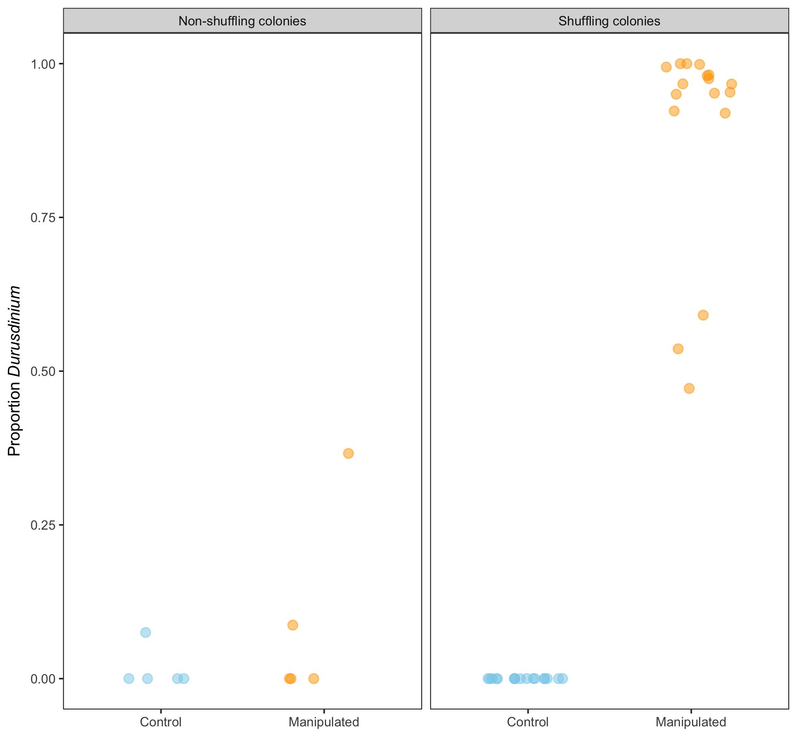

This repository includes all data and analysis to accompany the manuscript:

## Thermotolerant coral symbionts modulate heat stress-responsive genes in their hosts  

**Authors:** Ross Cunning, Andrew C. Baker  
**Journal:** *Molecular Ecology*  
**Link:** [pending]()

-----

#### Abstract  
Some corals may become more resistant to bleaching by shuffling their Symbiodiniaceae communities toward thermally tolerant species, and manipulations to boost the abundance of these symbionts in corals may increase resilience in warming oceans. However, the thermotolerant symbiont *Durusdinium trenchii* may reduce growth and fecundity in Caribbean corals, and these tradeoffs need to be better understood as this symbiont spreads through the region. We sought to understand how *D. trenchii* modulates coral gene expression by manipulating symbiont communities in *Montastraea cavernosa* to produce replicate ramets containing *D. trenchii* together with paired ramets of these same genets (n=3) containing *Cladocopium* C3 symbionts. We then examined differences in global gene expression between corals hosting *Durusdinium* and *Cladocopium* under control temperatures, and in response to short-term heat stress. We identified numerous transcriptional differences associated with symbiont identity, which explained 2-14% of transcriptional variance. Corals with *D. trenchii* upregulated genes related to translation, ribosomal structure, and biogenesis, and downregulated genes related to extracellular structures, and carbohydrate and lipid transport and metabolism, relative to corals with *Cladocopium*. Unexpectedly, these changes were similar to those observed in *Cladocopium*-dominated corals in response to heat stress, suggesting that thermotolerant *D. trenchii* may cause corals to increase expression of heat stress-responsive genes, explaining both the increased heat tolerance and associated energetic tradeoffs in corals containing *D. trenchii*. These findings provide insight into the ecological changes occurring on contemporary coral reefs in response to climate change, and the diverse ways in which different symbionts modulate emergent phenotypes of their hosts.

#### Study design schematic  

**Notes:**  
The tag-based RNAseq and gene ontology enrichment analyses conducted here are based on code from Misha Matz's [tag-based_RNAseq](http://github.com/z0on/tag-based_RNAseq) and [GO_MWU](http://github.com/z0on/GO_MWU) repositories, which have been modified and internalized for this specific project.

Raw Illumina sequence data associated with this project is available from NCBI: BioProject accession [PRJNA610282](https://www.ncbi.nlm.nih.gov/sra/PRJNA610282); SRA accession [SRP251653](https://www.ncbi.nlm.nih.gov/Traces/study/?acc=SRP251653).

-----

### Repository contents
#### Data:
* **data/sample_metadata.csv:** Sample metadata for corals in this study. Column headers: *colony* = colony/genet identifier; *core* = fragment/ramet identifier; *trt1* = symbiont manipulation treatment where *b* is bleached and recovered and *c* is ambient temperature control; *trt2* = short-term heat stress treatment where *h* is heated and *c* is control; *tank* = replicate tank identifier for corals in heat stress experiment.
* **data/PAM/:** Chlorophyll fluorescence data generated by WALZ I-PAM
  * \*.pim: PAM Imaging files (readable by ImagingWin software)
  * \*.csv: Fluorescence data for AOIs (areas of interest) in each I-PAM capture
  * \*_ids.txt: Metadata indicating which sample corresponds to each AOI
* **data/symbionts/:** Symbiont quantification data generated by qPCR
  * \*.eds: Experiment files generated by QuantStudio 3 (readable by Applied Biosystems Analysis Software)
  * \*.csv: qPCR data exported from experiment files  
* **data/genome/:** *Montastraea cavernosa* genome and annotation data  
* **data/tagseq/processed/:** Processed gene expression data (Raw data available at NCBI; see links above)
  * counts.txt: Feature count table for all genes and samples
  * count_totals.txt: Total raw, filtered, and mapped read counts for all samples

#### Analysis:

* **tagseq_bioinformatics.txt:** Bioinformatic analysis of tagSeq data (raw data -> gene counts)
* **Rmd/fvfm_analysis.Rmd:** Analysis of chlorophyll fluorescence data
* **Rmd/sym_analysis.Rmd:** Analysis of symbiont quantification qPCR data
* **Rmd/transcriptome_analysis.Rmd:** Analysis of gene expression data
* **Rmd/randomized_groups.Rmd:** Analysis of random permutations of gene expression dataset
* **Rmd/supp_barfield_reanalysis/:** Data from [Barfield et al. 2018](https://onlinelibrary.wiley.com/doi/abs/10.1111/mec.14774) [[Github repo](https://github.com/sbarfield/tagSeq-commonGarden)] and code for the reanalysis presented in [Figure S11](figures/FigS11.png).
* **Rmd/supplementary_information.Rmd:** The supplementary information associated with the publication, including Figures S1-S11 and Tables S1-S4.

#### Supporting code:  

  * **code/tagseq:** Perl scripts used in bioinformatic analysis of tagSeq data. These scripts are reproduced and adapted from Misha Matz' [tag-based_RNAseq](http://github.com/z0on/tag-based_RNAseq) repository.
  * **code/GO_MWU:** Perl and R scripts used in gene ontology enrichment analysis. These scripts are reproduced and adapted from Misha Matz' [GO_MWU](http://github.com/z0on/GO_MWU) repository.

#### Output:  

* **figures/\*.png:** PNG versions of all figures and supplemental figures.
* **output:** Various output tables and .RData files

