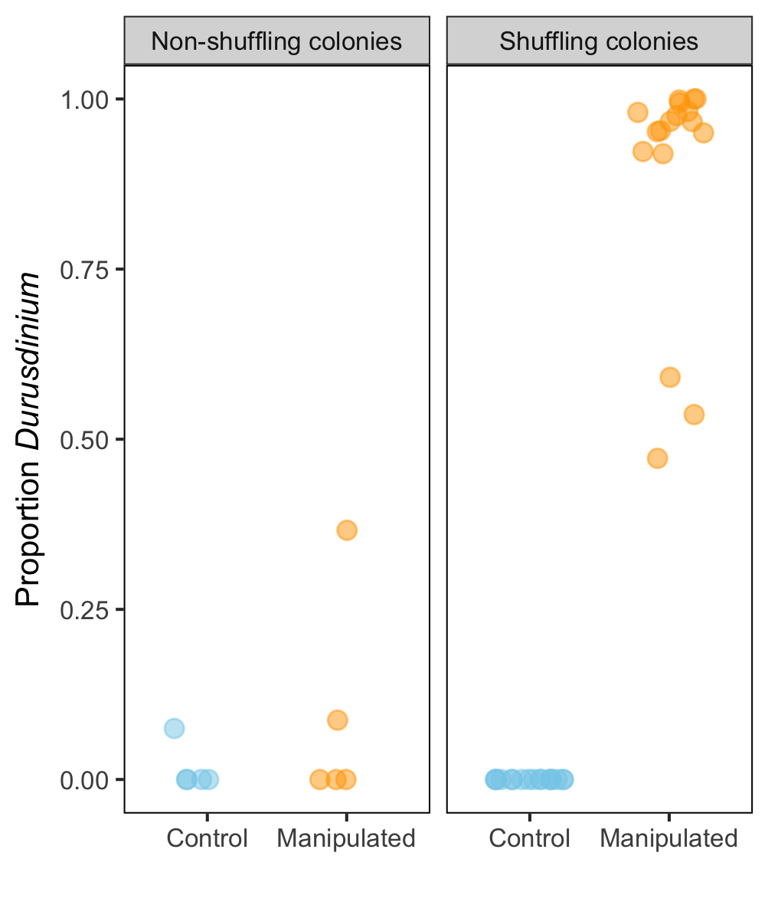
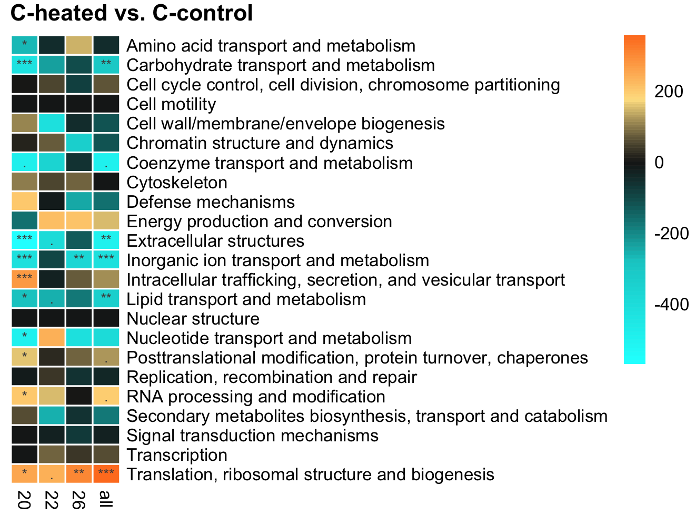
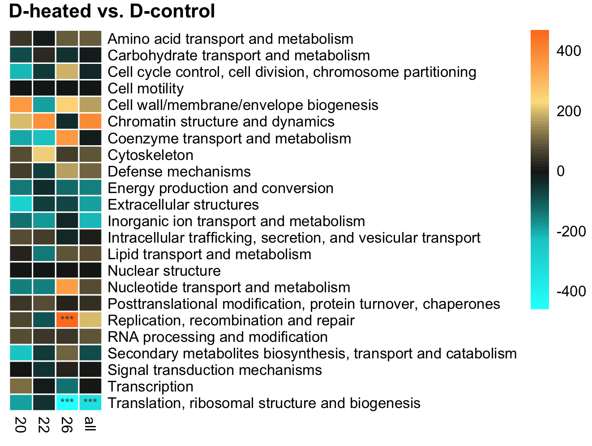
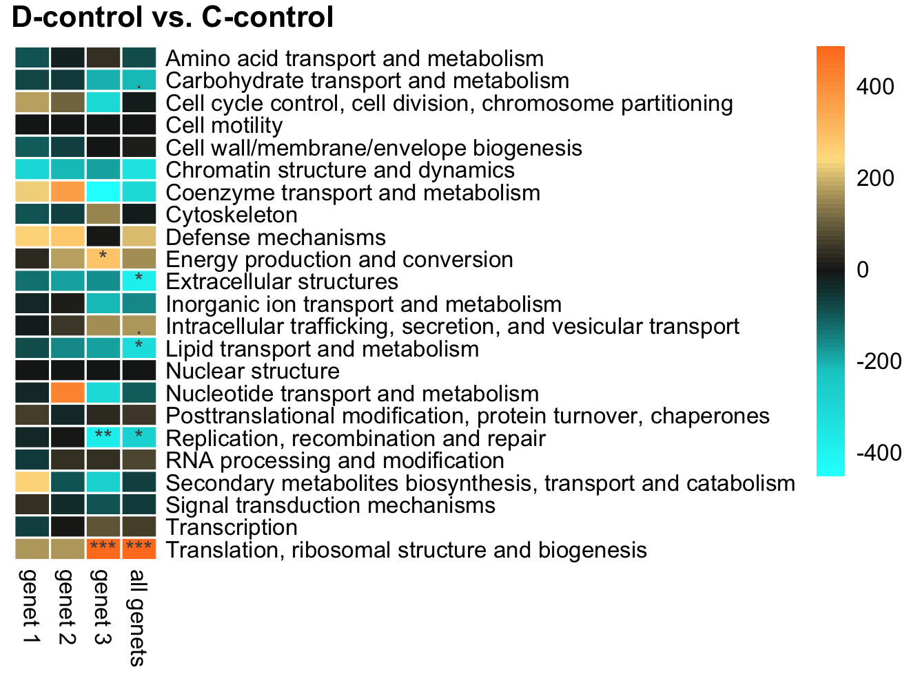
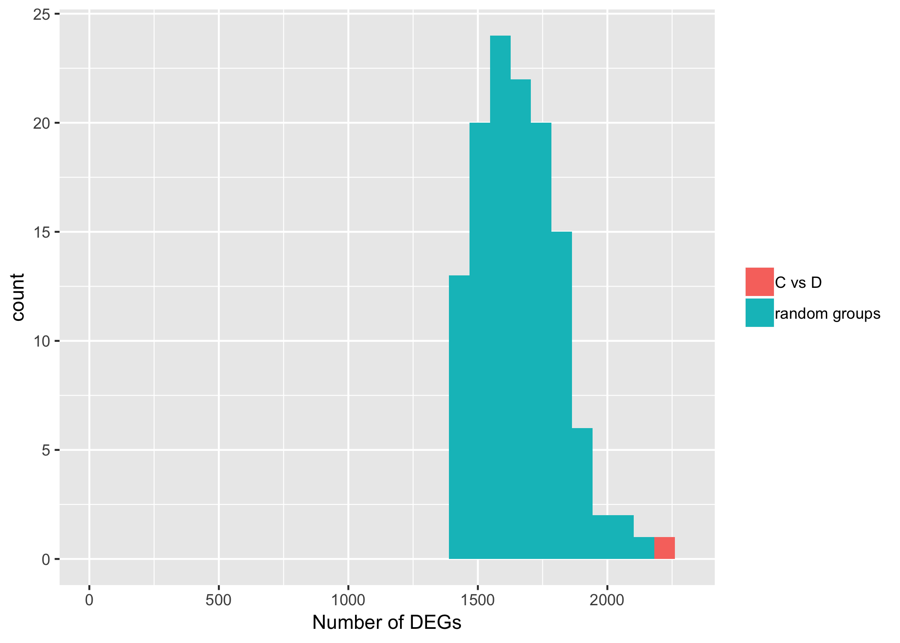

```{r setup, include=FALSE}
knitr::opts_chunk$set(echo = FALSE)
```

# Figure S1
```{r, out.width = "800px"}
knitr::include_graphics("figures/FigS1.png")
```

# Figure S2


# Figure S3


# Figure S4


# Figure S5


# Table S1
```{r}
go <- read.csv("output/allGO.csv")
knitr::kable(go)
```

# Figure S6

