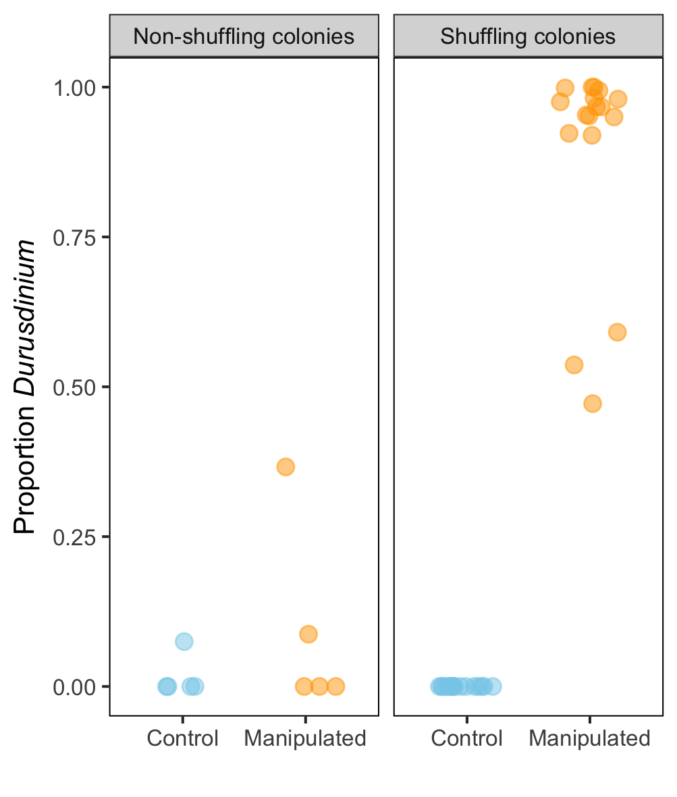
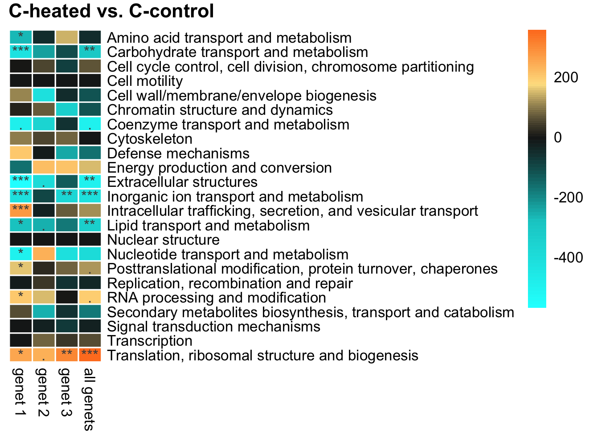

```{r setup, include=FALSE}
knitr::opts_chunk$set(echo = FALSE)
```

# Figure S1

Figure S1. The proportion of *Durusdinium* symbionts in control (unmanipulated) and manipulated (bleached and recovered) corals for genets (n=6) that did not shuffle their symbionts (left panel; 1 ramet per genet per treatment), and genets (n=3) that did shuffle their symbionts (right panel; 6 ramets per genet per treatment).

```{r, out.width = "800px"}
knitr::include_graphics("figures/FigS1.png")
```

# Figure S2

Figure S2. Eukaryotic orthologous group (KOG) analysis identified functional categories that were up- or down-regulated (indicated by color) in corals with *Durusdinium* at 26°C vs. corals with *Cladocopium* at 26°C. Columns show KOG categories for each coral genet individually, and when all genets are analyzed together (right-hand column). Asterisks indicate a statistically significant difference (. = p < 0.1, * = p < 0.05, ** = p < 0.01, *** = p < 0.001).  



# Figure S3

Figure S3. Eukaryotic orthologous group (KOG) analysis identified functional categories that were up- or down-regulated (indicated by color) in corals with *Cladocopioum* at 32°C vs. corals with *Cladocopium* at 26°C. Columns show KOG categories for each coral genet individually, and when all genets are analyzed together (right-hand column). Asterisks indicate a statistically significant difference (. = p < 0.1, * = p < 0.05, ** = p < 0.01, *** = p < 0.001). 


# Figure S4

Figure S4. Eukaryotic orthologous group (KOG) analysis identified functional categories that were up- or down-regulated (indicated by color) in corals with *Durusdinium* at 32°C vs. corals with *Durusdinium* at 26°C. Columns show KOG categories for each coral genet individually, and when all genets are analyzed together (right-hand column). Asterisks indicate a statistically significant difference (. = p < 0.1, * = p < 0.05, ** = p < 0.01, *** = p < 0.001). 


# Figure S5

Figure S5. Eukaryotic orthologous group (KOG) analysis identified functional categories that were up- or down-regulated (indicated by color) in corals with *Durusdinium* at 32°C vs. corals with *Cladocopium* at 32°C. Columns show KOG categories for each coral genet individually, and when all genets are analyzed together (right-hand column). Asterisks indicate a statistically significant difference (. = p < 0.1, * = p < 0.05, ** = p < 0.01, *** = p < 0.001). 


# Table S1

Table S1. All gene ontology (GO) terms identified by GO_MWU that were significantly different across all experimental contrasts (adjusted p-value < 0.01). Cheat = corals with *Cladocopium* at 32°C, Cctrl = corals with *Cladocopium* at 26°C, Dheat = corals with *Durusdinium* at 32°C, Dctrl = corals with *Durusdinium* at 26°C. BP = 'biological process', CC = 'cellular component', MF = 'molecular function'.
```{r}
go <- read.csv("output/allGO.csv")
knitr::kable(go)
```

# Figure S6

Figure S6. The number of differentially expressed genes (DEGs) detected between randomized groupings (n=126 permutations) of 5 Wilkie corals vs. 4 Wilkie corals, using the dataset of Barfield et al. 2018. The actual comparison of the 5 corals with clade C vs. the 4 corals with clade D is shown in red, while all randomized comparisons of 5 vs. 4 corals are shown in green. A p-value of 0.022 is used as a cutoff for DEGs since this is the empirical 10% FDR value calculated and used by Barfield et al. for this particular dataset. Code to reproduce this analysis and figure is available [here](supp_analysis_barfield/random_groups.Rmd).


