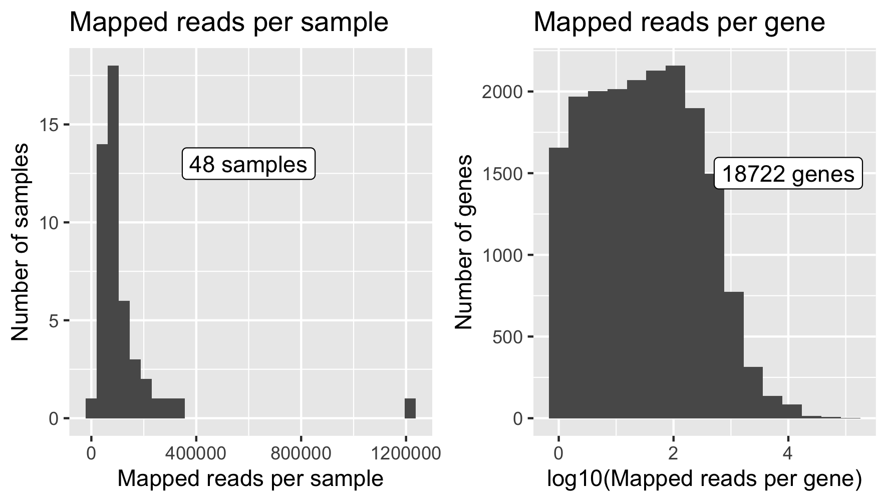
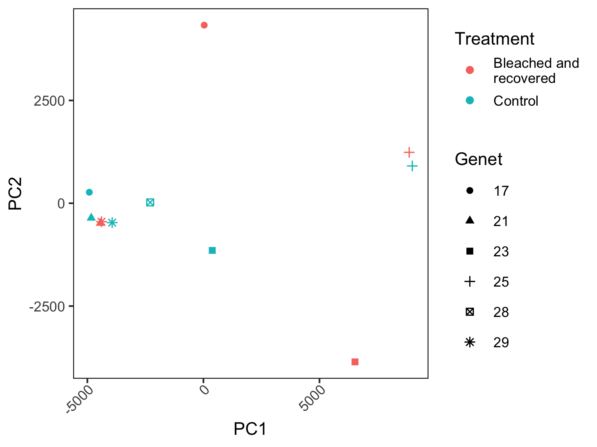
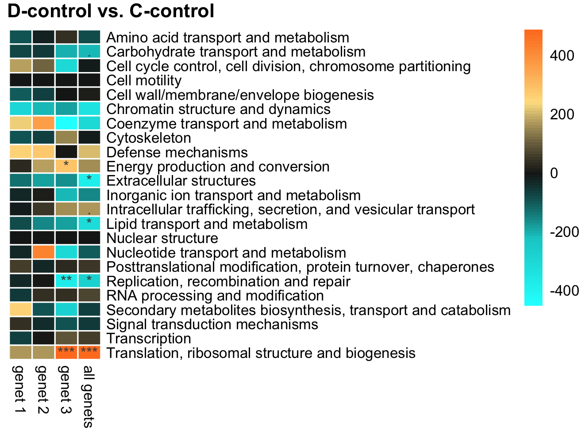
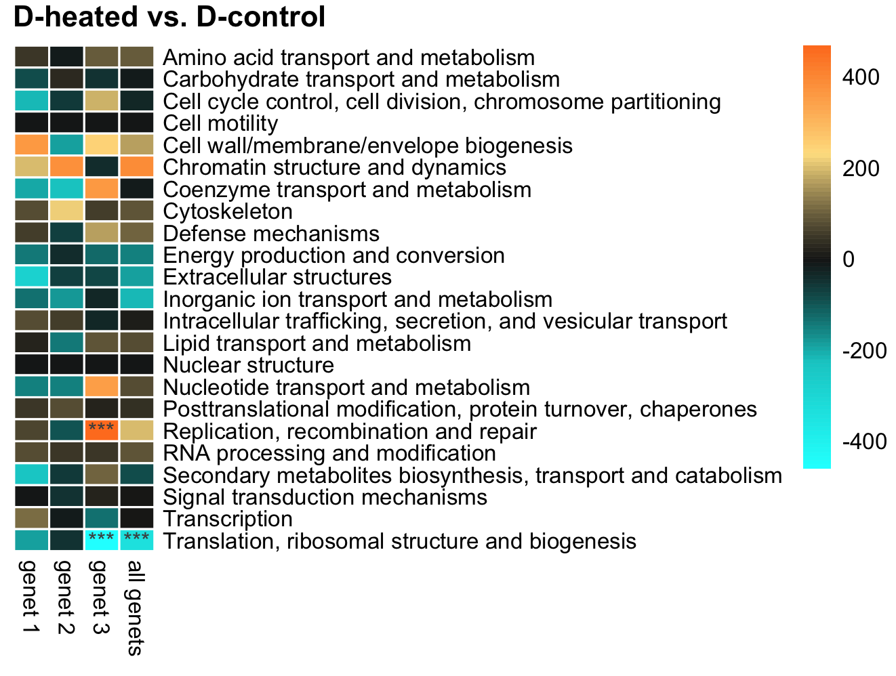
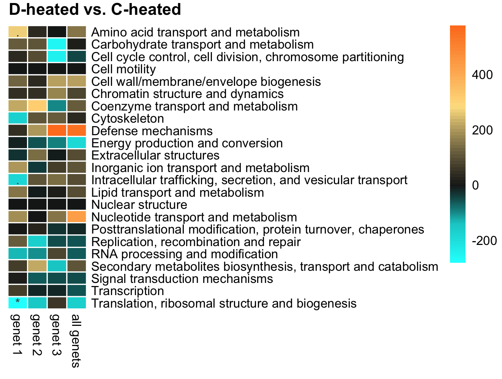
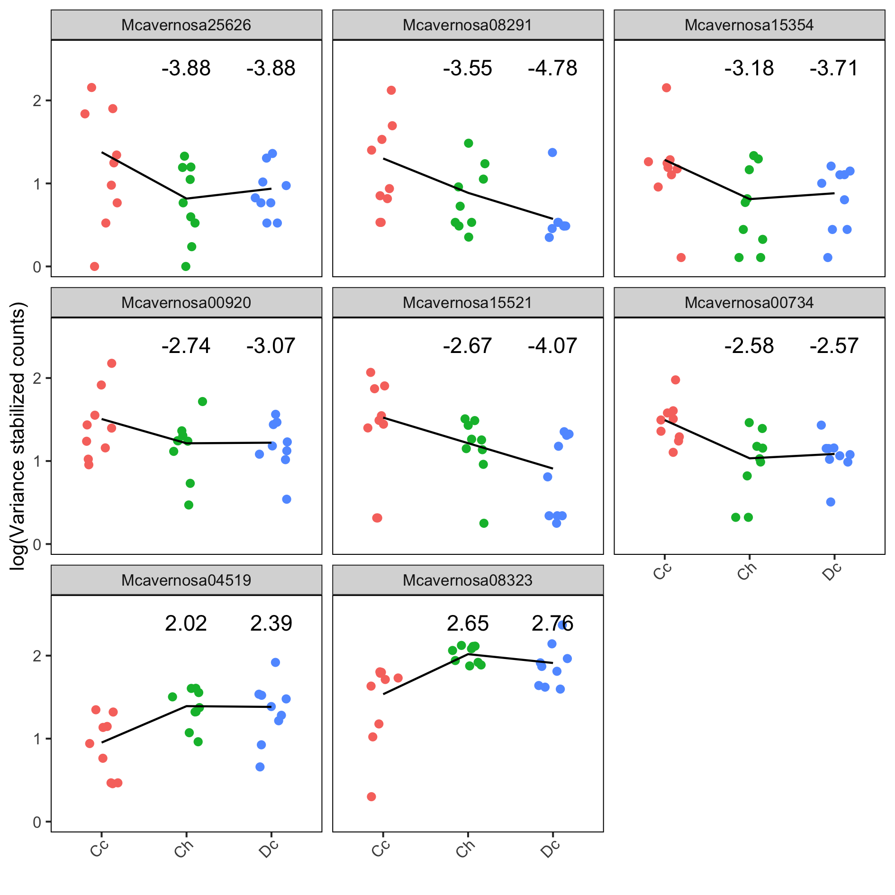
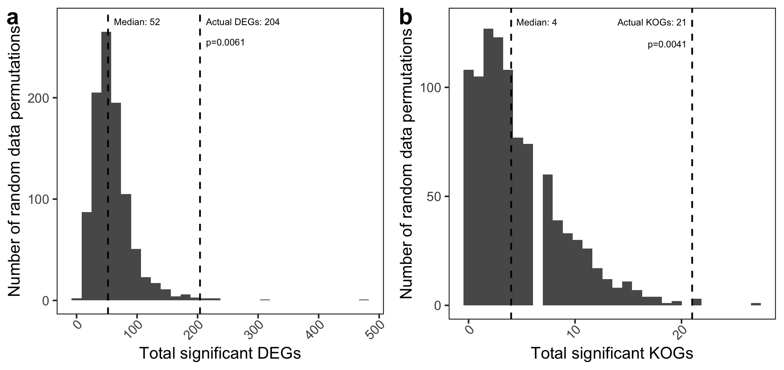

<style type="text/css">

h1.title {
  font-size: 26px;
  color: Black;
  text-align: center;
}
h3.subtitle {
  font-size: 38px;
  color: Black;
  text-align: center;
}
h4.author { /* Header 4 - and the author and data headers use this too  */
  font-size: 26px;
  color: Black;
  text-align: center;
}

</style>

```{r setup, include=FALSE}
knitr::opts_chunk$set(echo = FALSE, warning = FALSE, message = FALSE)

library(kableExtra)
library(tidyverse)
```


*****

## Figure S1

  
**Figure S1. Visual schematic of experimental design.** The differential expression contrasts we chose to analyse are presented, along with the question motivating each analysis.

*****

## Figure S2

{ width=50% }  
**Figure S2. Symbiont manipulations.** Points represent the proportion of *Durusdinium* symbionts in control (unmanipulated) and manipulated (bleached and recovered) coral ramets from genets (n=6) that did not shuffle their symbionts (left panel; 1 ramet per genet per treatment), and genets (n=3) that did shuffle their symbionts (right panel; 6 ramets per genet per treatment).

*****

## Figure S3


**Figure S3. TagSeq read counts.** The number of tagSeq reads per sample and per gene after quality control and mapping.

*****

## Figure S4

{ width=60% }  
**Figure S4. PCoA of gene expression in non-shuffling corals.** Principal coordinate analysis of variance-stabilized gene counts (n = 9,220 genes) for corals that bleached and recovered but did not change their symbionts, and paired samples of the same genets that remained under control contidions (all corals are dominated by *Cladocopium*). This analysis includes one sample of each genet in each treatment (bleached and recovered sample from genet 28 was excluded because it contained a high proportion of *Durusdinium*). No differentially expressed genes were detected between the treatment groups by DESeq2, controlling for host genet (see analysis code).

*****

## Figure S5
{ width=75% }  
**Figure S5. KOG analysis of D~C~ vs. C~C~.** Eukaryotic orthologous group (KOG) analysis identified functional categories that were up- or down-regulated (indicated by color) in corals with *Durusdinium* at 26°C vs. corals with *Cladocopium* at 26°C. Columns show KOG categories for each coral genet individually, and when all genets are analyzed together (right-hand column). Asterisks indicate a statistically significant difference (. = p < 0.1, * = p < 0.05, ** = p < 0.01, *** = p < 0.001).  

*****

## Figure S6
{ width=75% }    
**Figure S6. KOG analysis of C~H~ vs. C~C~.** Eukaryotic orthologous group (KOG) analysis identified functional categories that were up- or down-regulated (indicated by color) in corals with *Cladocopioum* at 32°C vs. corals with *Cladocopium* at 26°C. Columns show KOG categories for each coral genet individually, and when all genets are analyzed together (right-hand column). Asterisks indicate a statistically significant difference (. = p < 0.1, * = p < 0.05, ** = p < 0.01, *** = p < 0.001). 

*****

## Figure S7
{ width=75% }    
**Figure S7. KOG analysis of D~H~ vs. D~C~.** Eukaryotic orthologous group (KOG) analysis identified functional categories that were up- or down-regulated (indicated by color) in corals with *Durusdinium* at 32°C vs. corals with *Durusdinium* at 26°C. Columns show KOG categories for each coral genet individually, and when all genets are analyzed together (right-hand column). Asterisks indicate a statistically significant difference (. = p < 0.1, * = p < 0.05, ** = p < 0.01, *** = p < 0.001). 

*****

## Figure S8
{ width=75% }    
**Figure S8. KOG analysis of D~H~ vs. C~H~.** Eukaryotic orthologous group (KOG) analysis identified functional categories that were up- or down-regulated (indicated by color) in corals with *Durusdinium* at 32°C vs. corals with *Cladocopium* at 32°C. Columns show KOG categories for each coral genet individually, and when all genets are analyzed together (right-hand column). Asterisks indicate a statistically significant difference (. = p < 0.1, * = p < 0.05, ** = p < 0.01, *** = p < 0.001). 

*****

## Figure S9
{ width=75% }  
**Figure S9. Counts and log2(fold-changes) for genes differentially expressed in both heated and shuffled corals.** These eight individual genes were significantly differentially expressed (adjusted p < 0.1) when *Cladocpium* corals were heated (C~H~ vs. C~C~) and when shuffled to *Durusdinium* dominance (D~C~ vs. C~C~). Normalized (by DESeq2 sizeFactors and variance-stabilization) and log-transformed counts are plotted for all ramets per treatment (n=9). Lines connect the mean counts for each group, and text annotations give the log2(fold-change) value for the C~H~ and D~C~ treatments relative to C~C~. Functional annotations for these genes are provided in Table SX.

*****

## Figure S10

  
**Figure S10. Significant DEGs and KOGs resulting from random permutations of our dataset.** We generated n=1500 random permutations of our dataset by shuffling the symbiont type (C- or D-dominated) and temperature treatment (control or heated) assignments within each genet. We then repeated the differential expression analysis for each permuted dataset and measured the total number of significant DEGs and KOGs (see Methods) across all of the six possible pairwise contrasts among the four treatment groups. The histograms in panel **a** and **b** give the total number of DEGs and KOGs, respectively, for random permutations. Vertical dashed lines indicate the median number across all random permutations, and the actual number arising from the real groupings, as well as the p-value testing the null hypothesis that the actual number could arise by chance. Code to reproduce this analysis and figure is available [here](randomized_groups.Rmd).

*****

## Figure S11

{ width=60% }  
**Figure S11. The number of differentially expressed genes (DEGs) detected between randomized groupings (n=126 permutations) of 5 Wilkie corals vs. 4 Wilkie corals, using the dataset of Barfield et al. 2018.** The actual comparison of the 5 corals with clade C vs. the 4 corals with clade D produced 2252 DEGs, while all randomized comparisons of 5 vs. 4 corals produced a median of 1634 genes, and a minimum of 1420. A p-value of 0.022 is used as a cutoff for DEGs since this is the empirical 10% FDR value calculated and used by Barfield et al. for this particular dataset. Code to reproduce this analysis and figure is available [here](supp_analysis_barfield/random_groups.Rmd).

*****

## Table S1

**Table S1. TagSeq read counts per sample.** Shown are the minimum, maximum, and median number of read counts per sample at the raw, post-quality control, and post-mapping stages, along with the total  number of reads at each stage.

```{r}
tab <- read_csv("output/readcounttable.csv")
knitr::kable(tab) %>%
  kable_styling("striped", full_width = TRUE)
```

*****

## Table S2

**Table S2. Gene ontology enrichment.** All gene ontology (GO) terms identified by GO_MWU that were significantly different across all experimental contrasts (adjusted p-value < 0.01). Cheat = corals with *Cladocopium* at 32°C, Cctrl = corals with *Cladocopium* at 26°C, Dheat = corals with *Durusdinium* at 32°C, Dctrl = corals with *Durusdinium* at 26°C. BP = 'biological process', CC = 'cellular component', MF = 'molecular function'. The fraction in the 'genes' column indicates the number of genes annotated with the term that have an unadjusted p-value <= 0.05 in the differential expression analysis.
```{r}
go <- read.csv("output/allGO.csv")
knitr::kable(go) %>%
  kable_styling("striped", full_width = TRUE)
```

*****

## Table S3
**Table S3. KOG term enrichment.** All KOG terms identified by KOGMWU that were significantly different across all experimental contrasts for all coral genets analyzed together (adjusted p-value <0.1). The fraction in the 'genes' column indicates the number of genes annotated with the term that have an unadjusted p-value <= 0.05 in the differential expression analysis.

```{r}
kog <- read_tsv("output/kogout.txt")
knitr::kable(kog) %>%
  kable_styling("striped", full_width = TRUE)
```

*****

## Table S4

**Table S4. Functional annotations for eight genes differentially expressed in both heated and shuffled corals.** Annotations come from the *M. cavernosa* genome trinotate annotation report generated by the Matz Lab at UT Austin, available at: https://matzlab.weebly.com/data--code.html (Accessed 2019-04-29). Expression data for these genes is presented in Figure S9.
```{r}
ganno <- read_tsv(file = "output/geneanno.tsv") %>%
  select(gene, sprot_Top_BLASTP_hit, gene_ontology_blast)

# Replace some  delimiter characters that disrupt HTML parsing
ganno <- mutate_if(ganno, is.character, str_replace_all, pattern = "\\^", replacement = "\\\\")
ganno <- mutate_if(ganno, is.character, str_replace_all, pattern = "\\`", replacement = "||||")

# Print table
knitr::kable(ganno) %>% 
  kable_styling("striped") %>% 
  column_spec(1:3, width_max = "50em") %>% 
  scroll_box(height = "50em", width = "100%")
```


